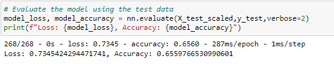
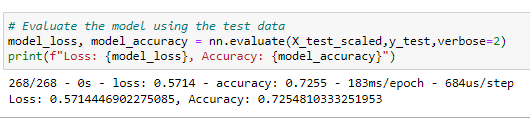
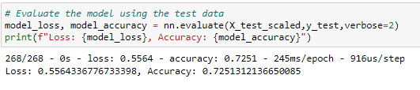
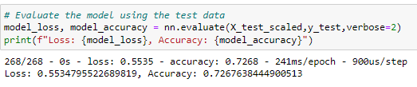

# Neural_Network_Charity_Analysis

## Overview of the analysis 

The purpose of the analysis was to create a binary classification and thereby to predict whether the 
applicant will be successful if funded by Alphabet Soup. 

- To preprocess the data for a Neural Network Model 
- To compile, train, and evaluate the model 
- To optimize the model 

## Resources 

Dataset: charity_data.csv,
Python 3.7.6 and Anaconda 2020.11 

## Results

#### Data Preprocessing 
     
    - The Variable IS_SUCCESSFUL was considered as the target for the model. 
    - Variables such as APPLICATION_TYPE, AFFILIATION, CLASSIFICATION, USE_CASE, 
      ORGANIZATION, STATUS, INCOME_AMT, SPECIAL_CONSIDERATIONS and ASK_AMT were the features for the model. 
    - Variables EIN and NAME were removed from the model. 
 
#### Compiling, Training, and Evaluating the Model

    - For deep-learning neural network model I used two hidden layers with 80 and 30 neurons, respectively. 
      Activation function 'relu' was used for two hidden layer and sigmoid was used for the output layer.
      And achieved 66% accuracy, however during combiling chekcpoint process (model fit using X_train scaled)
      the accuracy value was increased to 73%. 

    
#### Attempts to increase the model performance 

##### Attempt 1:- adding more neurons to layer 1 and 2 
- In first attempt the number of neurons were increased to 100 and 40 for layer 1 and 2, 
  respectively. 

##### Attempt 2:- adding more hidden layers 
- In this model three layers were applied with neurons number of 80, 30, and 10 for layers 1, 2 and 3, respectively.

##### Attempt 3:- using different activation functions for hidden layers 
- For this model activation function 'tanh' was used for hidden layers 1 and 2. 

## Summary 

Based on the above analysis made to optimize the model, there were no difference among the three models in accuracy 
and loss values and about 73% accuracy was achieved. However, the model did achieve the target model performance of 75% accuracy. 
Models such as Random Forest Classifier could improve the predictive accuracy of the model since we created a binary classification 
and this model can combine multiple smaller models into a more robust, and its ability to train large dataset.  

